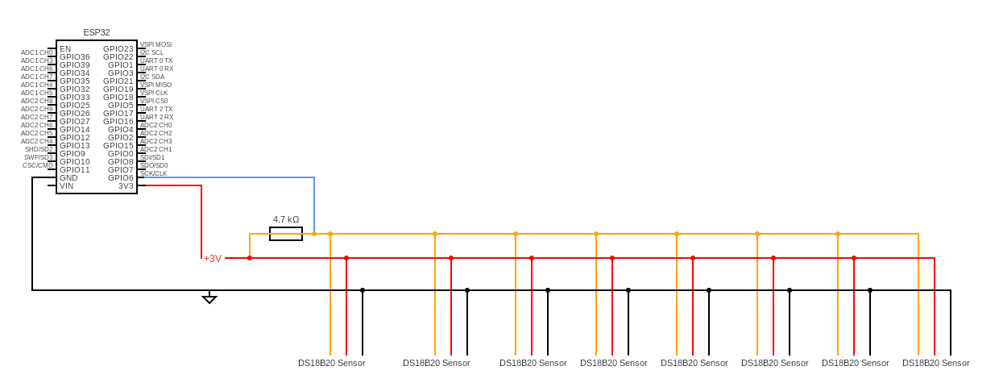

# garden bed temperature sensors

## About
The goal of this project is to provide remote monitoring for my raised garden beds and watering tank. The garden beds will have a near-surface temperature probe, a mid-level probe, and a floor probe at ground level, inside the bed. Additional probes will be used to measure air temperature and the water tank temperature.

## Budget & Cost

## Build List

- (1) ESP32 of some type. I chose a Heltec ESP32 with LCD and Lora.
- (8) DS18B20 Temperature Probes
- (1) 4700K Ohm resistor
- Wire (10' - 100' of 18ga wire)

## Required Tools
- soldering iron
- wire stripper

## Instructions

The basic idea is to run a 3.3v rail and a ground rail, and to strip the wire at junctions where we will tie off a line to feed each set of probes.
