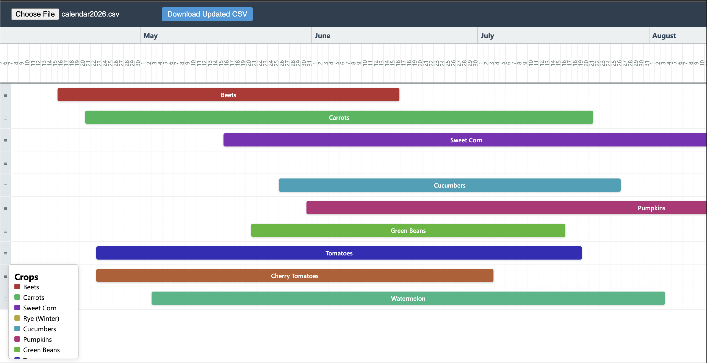

# Crop Timeline

This is a simple self-hosted JavaScript tool that will let you upload a csv containg a crop name, start and end date, and visualize it.

Instead of a normal calendar view, this is linear `----> ----> ---->`

You can drag and drop their order, and drag and drop to new start dates.

You can host this yourself simply by copying the HTML to your own server. Or, there is an example hosted here: [tbd]

